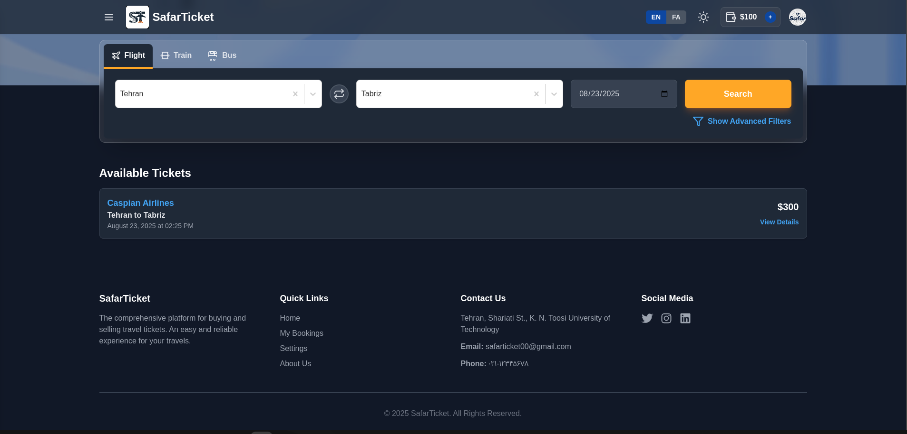
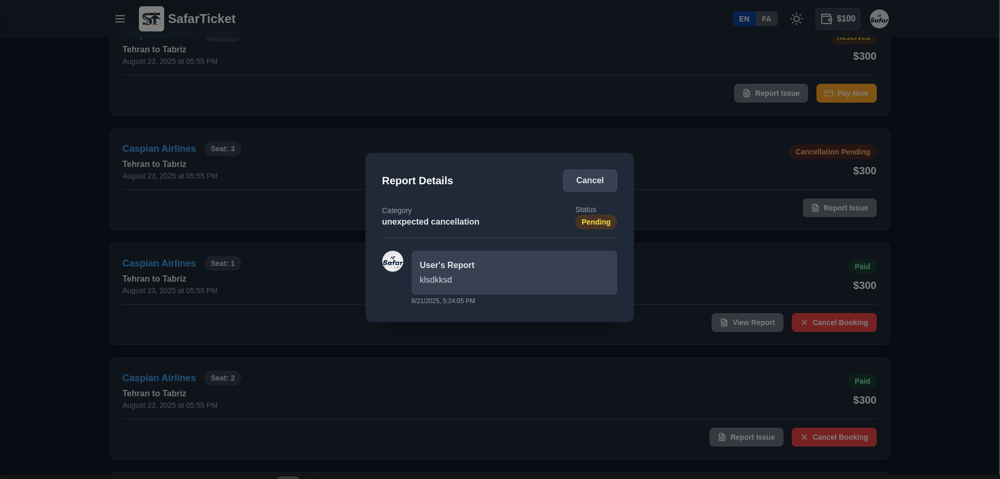
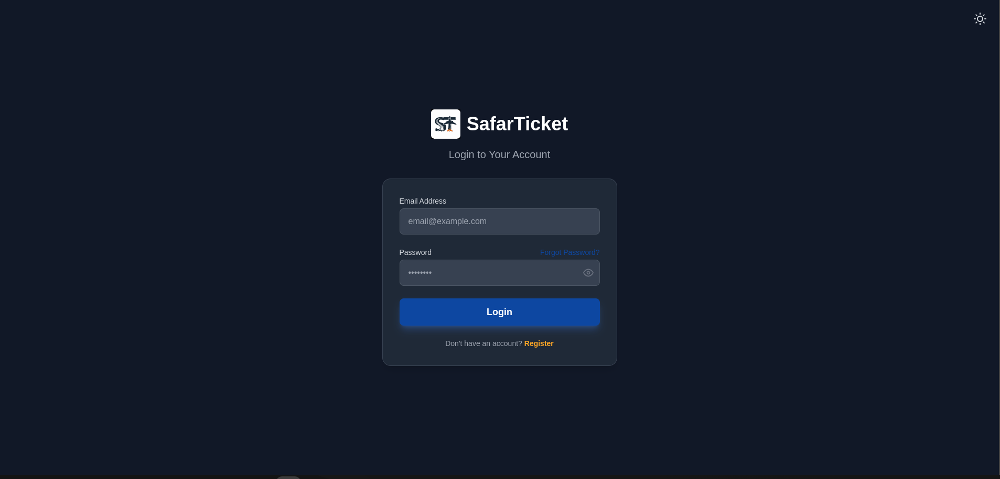
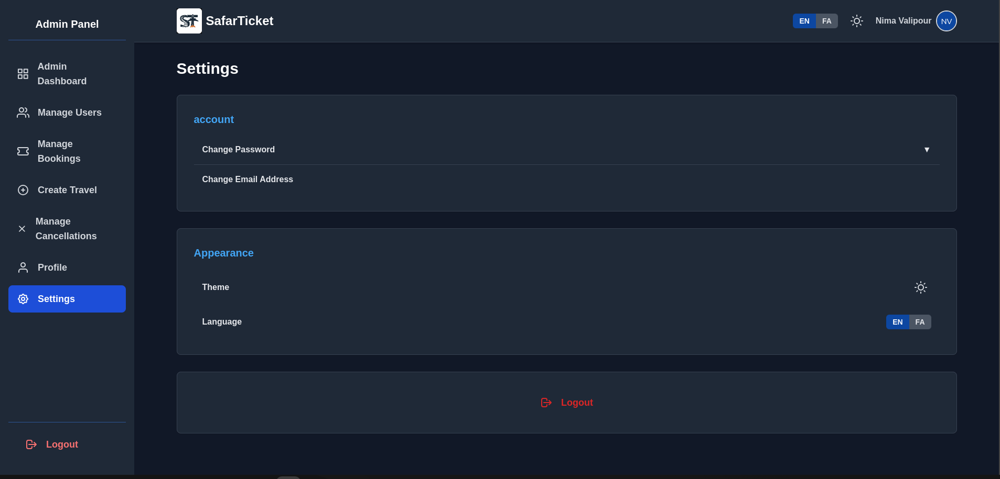

#  SafarTicket

This project, developed as part of a database course, is a complete platform for searching, reserving, and purchasing travel tickets (flights, trains, and buses). It features a modern, multi-layered architecture, including a user-facing panel and a full-featured admin panel.

---

## 📖 Table of Contents
- [⚙️ Setup & Installation](#️-setup--installation)
- [🔧 Configuration & Security](#-configuration--security)
- [🚀 Running the Project](#-running-the-project)
- [✨ Core Features](#-core-features)
- [🚀 Search Optimization with Elasticsearch](#-search-optimization-with-elasticsearch)
- [🛠️ Technology Stack](#️-technology-stack)
- [🖼️ Application Screenshots](#️-application-screenshots)
- [✅ Design Notes](#-design-notes)
- [📌 Future Improvements](#-future-improvements)

---

## ⚙️ Setup & Installation

To run this project locally, you will need **Docker** and **Docker Compose**.

**1. Clone the Repository:**
```bash
git clone <your-repository-url>
cd <project-folder>
```

---

## 🔧 Configuration & Security

This project uses environment variables for configuration. The system is designed to be secure by separating sensitive data from the main codebase.

**1. Create the Environment File:**
Create a `.env` file in the project root by copying the example file:
```bash
cp .env.example .env
```
**2. Edit the `.env` File:**
Now, open the `.env` file and fill in the necessary values, especially for `SECRET_KEY`, `JWT_SECRET_KEY`, and any passwords.

**Important:** The `.env` file is listed in `.gitignore` and should **never** be committed to the repository.

---

## 🚀 Running the Project

Execute the following command in your terminal. The `--build` flag will build the Docker images from scratch if they don't exist.
```bash
docker-compose up --build
```
After all services are up and running, the frontend will be available at `http://localhost:3000` and the backend at `http://localhost:8000`.

---

## ✨ Core Features

The platform is divided into two main sections:

### User Panel
- **Advanced Search:** Search for tickets by origin, destination, date, and transport type.
- **Filter Results:** Filter search results by price, transport company, travel class, and more.
- **View Trip Details:** See all relevant information for a specific trip, including amenities.
- **Seat Selection:** An interactive graphical map for selecting seats.
- **Reservation & Payment:** A complete workflow for temporarily reserving a ticket (locking the seat for 10 minutes) and finalizing the payment via an internal wallet or a mock payment gateway.
- **Booking Management:** View travel history, cancel tickets according to penalty rules, and track their status.
- **Issue Reporting:** Ability to submit reports regarding ticket or travel issues and view admin responses.
- **User Profile:** Manage personal information, change passwords, update email (with OTP verification), and configure application settings (light/dark theme and language).

### Admin Panel
- **Management Dashboard:** View key statistics like total users, daily bookings, pending cancellations, and open reports.
- **Sales Chart:** A graph visualizing sales volume over the last 30 days for trend analysis.
- **User Management:** View a complete list of users, search by name, email, or city, and activate/deactivate their accounts.
- **Booking Management:** View and manage all reservations made in the system with the ability to change their status.
- **Create New Travel:** An advanced form to define new trips in the system, featuring searchable dropdowns for cities, terminals, and companies.
- **Cancellation Management:** Review and approve or reject user cancellation requests, with automatic refunds to their wallet.
- **Report Management:** View user-submitted reports and respond to them directly from the panel.

---

## 🚀 Search Optimization with Elasticsearch

A primary goal of Phase 4 was to enhance the performance and scalability of the ticket search feature. In large-scale systems, querying the primary database (MySQL) directly with multiple filters can quickly become a bottleneck.

To solve this, the **Elasticsearch** search engine was integrated as a dedicated search layer. This architecture provides several key advantages:

1.  **High-Speed Performance:** Elasticsearch is optimized for full-text search and complex data filtering. This ensures that search queries are answered almost instantly, even with a large volume of data.
2.  **Reduced Load on Primary Database:** By offloading the search workload to Elasticsearch, the primary MySQL database is freed up to focus on its core responsibility: handling transactions (bookings, payments, user registrations).
3.  **Advanced Search Capabilities:** Elasticsearch provides powerful features like suggestions, aggregations, and advanced result ranking, which can be easily added to the project in the future.

### Implementation Details

- **Data Synchronization (`es_utils.py`):** A synchronization utility was created in the backend. Whenever a `Travel` document is created, updated (e.g., `remaining_capacity` changes), or deleted in MySQL, this utility is triggered to apply the same change to the Elasticsearch index. This ensures the search data is always up-to-date.
- **Optimized Search API (`search_tickets.py`):** The main ticket search API was refactored to query Elasticsearch instead of MySQL. It translates the user's search request into a standard Elasticsearch query (using `match`, `term`, and `range` filters) and returns the results.

This architecture makes the system more scalable and provides a significantly better user experience during the ticket search process.

---

## 🛠️ Technology Stack

- **Backend:** Python (Django REST framework)
- **Frontend:** JavaScript (React.js)
- **Primary Database:** MySQL
- **Caching & OTPs:** Redis
- **Search Engine:** Elasticsearch
- **Containerization:** Docker & Docker Compose
- **Styling:** Tailwind CSS
- **Internationalization:** i18next

---

## 🖼️ Application Screenshots

<details>
<summary><b>📷 User Panel</b></summary>
<br>

**Home & Search Results**



**Ticket Details & Seat Selection**


**Payment & Bookings Management**


**Issue Reporting**



**Profile & Settings**


**Authentication**



</details>

<details>
<summary><b>🔑 Admin Panel</b></summary>
<br>

**Dashboard (Light & Dark)**


**User & Booking Management**


**Travel & Cancellation Management**


**Profile, Settings & Login**




</details>

---

## ✅ Design Notes

- **UI/UX:** The design prioritizes a clean, modern, and responsive user interface, with a consistent dark/light theme across both user and admin panels.
- **Color Palette:** The color scheme is based on Dark Blue (Primary), Light Blue (Secondary), Bright Orange (Accent), and Dark Gray (Text), creating a professional and trustworthy feel.
- **Component-Based:** The frontend is built using a component-based architecture in React, promoting reusability and maintainability.

---

## 📌 Future Improvements

- **Real Payment Gateway Integration:** Replace the mock payment system with a real-world gateway like Stripe or ZarinPal.
- **User Reviews:** Allow users to review transport companies and specific trips.
- **Real-time Notifications:** Implement a WebSocket-based system for real-time notifications (e.g., travel delays, booking confirmations).
- **Advanced Analytics:** Expand the admin dashboard with more detailed analytics and reports.
